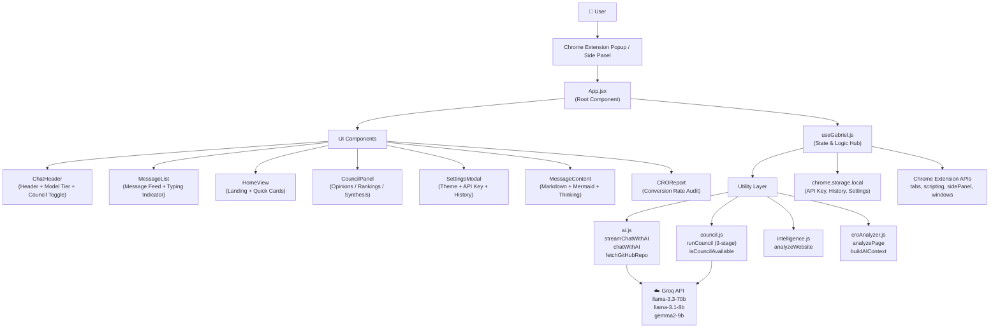
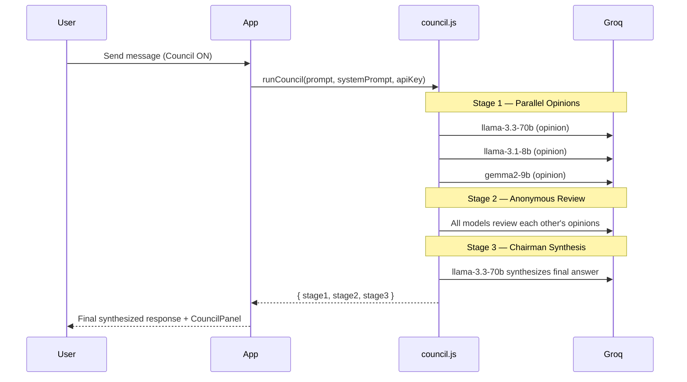
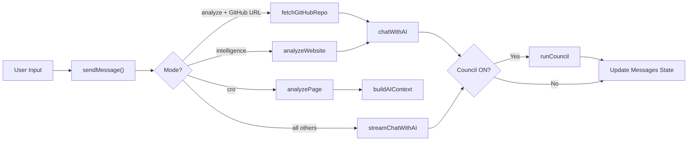

# Gabriel AI — Architecture

Gabriel is a Chrome extension built with React + Vite that provides multi-model AI assistance directly in the browser.

## High-Level Architecture



## Component Tree

```
App
├── ErrorBoundary          (crash recovery)
├── SettingsModal          (theme, API key, history)
├── ChatHeader
│   ├── Header bar         (logo, mode label, action buttons)
│   ├── ModelTierBar       (70B / 8B / 9B selector)
│   └── CouncilToggleBar   (ON/OFF + hint)
├── main.content
│   ├── SearchBar          (inline, conditional)
│   ├── HomeView           (landing cards, shown when no messages)
│   ├── CROReport          (conversion audit, conditional)
│   └── MessageList
│       ├── Message (user)
│       └── Message (assistant)
│           ├── ThinkingBlock   (chain-of-thought, collapsible)
│           ├── MessageContent  (markdown + mermaid diagrams)
│           └── CouncilPanel    (opinions / rankings / synthesis tabs)
└── Footer
    ├── Textarea input
    ├── ReadPage button
    └── Send button
```

## State Management

All application state lives in the `useGabriel` hook — no external state library is needed for a Chrome extension popup.

| State slice | Managed by |
|---|---|
| Messages, mode, input | `useGabriel` → `useState` |
| API key, theme, history | `useGabriel` → `chrome.storage.local` |
| Council results | `useGabriel` → `useState` |
| CRO analysis | `useGabriel` → `useState` |
| UI state (settings open, search) | `App.jsx` → `useState` |

## Council Mode — 3-Stage Pipeline



## Data Flow



## Security

- **DOMPurify** sanitizes all AI-generated HTML before rendering
- `FORBID_TAGS`: `script`, `iframe`, `object`, `embed`, `form`
- `FORBID_ATTR`: `onerror`, `onload`, `onclick`, `onmouseover`
- API keys stored in `chrome.storage.local` (not localStorage)
- **ErrorBoundary** wraps the entire app for crash recovery
